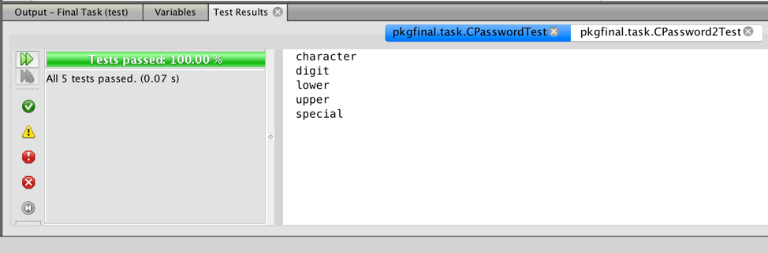

# Unit Tests for password checking

### User's password requirements
1. At least 6 characters
1. Must contain at least one lower case letter
1. Must contain at least one upper case letter
1. Must contain one digit
1. Must contain one of these special characters: **~!@#$%^&*()_+**
  
  

Format: 
